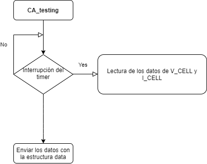

# Proyecto: Potenciostato

En el presente documento se detalla la programación de un potenciostato portable para poder realizar dos tipos de mediciones electroquímicas: voltammetría cíclica y cronoamperometría. En este proyecto se ha realizado el **control** de un potenciostato a través de un **microcontrolador**. El microcontrolador es una herramienta muy útil que nos va a permitir connectar el potenciostato a un **ordenador** que actuará como interficie de usuario para que este pueda hacer cambios en el sistema y a la vez visualice los resultados. Los objetivos específicos se describen en la siguiente sección. 

## Contenidos

- [Introducción](#introducción)
- [Objetivos](#objetivos)
- [Diseño](#diseño)
- [Resultados](#resultados)
    - [Voltammetría Cíclica de Díodos](#voltammetría-cíclica-de-díodos)
    - [Cronoamperometría de Díodos](#cronoamperometría-de-díodos)   
    - [Voltammetría Cíclica de un compuesto](#voltammetría-cíclica-prueba-electroquímica)
    - [Cronoamperometría de un compuesto](#cronoamperometría-prueba-electroquímica)   
- [Conclusiones](#conclusiones)

## Introducción

Con los avances en miniaturización es posible diseñar complejos **SoC** (Systems-on-Chip) en espacios reducidos, y obtener dispositivos portátiles con un gran impacto en el _healthcare_. Para ello, los biopotenciostatos son de las partes más importantes que componen un **biosensor**. Este controla una celda compuesta de tres electrodos: el **electrodo de trabajo** (WE), **el de referencia** (RE), y un **electrodo auxiliar** (AUX). El circuito manteniene el potencial del electrodo de trabajo a un nivel constante con respecto al potencial del electrodo de referencia, mediante el ajuste de la corriente en el electrodo auxiliar. 

Este componente es fundamental para aquellos **estudios electroquímicos** con sistemas de tres electrodos empleados en el estudio de reacciones redox y otros fenómenos químicos. 

Una de estas medidas electroquímicas es la **Voltammetria Cíclica** (CV), un tipo de medición potenciodinámica, es decir, dónde se aplica un potencial variable a una celda electroquímica. Por otro lado, se mide la corriente que esta celda proporciona y se representa frente al voltaje aplicado. El potencial se mide entre el electrodo de trabajo y el electrodo de referencia, mientras que la corriente se mide entre el electrodo de trabajo y el auxiliar. El potencial del electrodo aumenta linealmente en **función del tiempo** en las **fases cíclicas** hasta que alcanza un valor y cambia de dirección. Este mecanismo se denomina **barrido triangular** de potencial y se puede ver representado en la siguiente figura [1](Docs/assets/triangular-excitation-CV.png). La tasa de cambio de voltaje a lo largo del tiempo durante cada una de estas fases se conoce como **velocidad de exploración** (V/s).

La otra medida tratada en este proyecto es la **Cronoamperometría** (CA). En esta se aplica un **señal escalón**, elevando el valor del potencial a una tal que ocurre una reacción redox. Y entonces, se mide la **variación de la respuesta** de la corriente en función del **tiempo**. 

Con tal de entender el proyecto, se darán cuatro pinceladas de los compomentes del circuito _e-Reader_ (_PMU_, _Front-End_, Microcontrolador y unidad de visualización) del potenciostato que se acompañaran con un esquema del circuito _Front-End_. En este esquema no se detalla ni la fuente de alimentación ni el sensor, en nuestro caso uno de tres electrodos. Como podemos contemplar en la siguiente figura la **PMU** extrae alimentación de la fuente y la convierte en los señales de control y de suministro de voltaje. Al mismo tiempo el **_Front-end_** obtienen las medidas. El voltage de salida del _Front-end_ es procesador por el **microcontrolador** y se envia a la interfície de **LabView _viSens-S_**, en nuestros ordenadores. 

El _Front-end_ se encarga de estabilizar la diferencia de voltaje entre los electrodos de la celda electroquímica y leer/procesar la señal de salida. El voltage de regulación (VLDO) alimenta los componentes analógicos del _Front-end_. Tal y como vemos en el circuito, el primer amplificador es un Op-Amp que se usa como control. Este proporciona al sensor el VIN, ajustado con un divisor de tensión (R1 y R2). También nos encontramos con un amplificador búfer. Este lo utilizamos para aislar. El VOCV es controlado por el ADC del microcontrolador y aplicado a CE (en la celda) como referencia. En el momento de tomar la muestra el relé (Switch) se cierra. Y el TIA (amplificador de transimpedancia) genera la señal de salida, através de la RTIA, que es proporcional a la corriente en la celda[1]. 

## Objetivos

- Principal: Programar un potenciostato portable.
- Controlar la Power Management Unit (PMU) del módulo front-end del potenciostato.
- Mandar y recibir datos desde el potenciostato. 
- Obtener señales del timer para controlar los tempos. 
- Generar interrupciones en la secuencia de acciones. 
- Convertir señales analógicas en digitales y viceversa. 
- Comunicarse con la aplicación viSens-S instalada con el host u ordenador mediante el protocolo MASB-COMM-S.
- Testear la voltammetría cíclica.
- Testear la cronoamperometría.
- Implementar la branching policy para el control de versiones. 

## Diseño

Para cada funcionalidad descrita se ha configurado una herramiento del microcontrolador:
- **USART**: permite recibir/enviar datos a través de los puertos habilitados.

Seleccionamos _modo asíncrono_ en el campo `Mode` y en la parte inferior seleccionamos los **parámetros de la comunicación**: *baud rate*, *bits de datos*, *paridad*, *número de bits de stop* y *oversampling* (lo dejamos en 16 muestras). 

- **I2C**: protocolo de transmisión de información. 

Asignaremos a PB8 y PB9 las funciones I2C_SCL (Serial Clock) y I2C_SDA (Serial Data) respectivamente. 

- **TIMERS**: relojes que generan interrupciones cada ciertas unidades de tiempo.

Si el timer opera con una frecuencia de 84 MHz como se indica en la _Clock Configuration_, tenemos que dejar que el timer cuente hasta 84,000,000 para que pase 1 segundo. En el campo _Counter Period_ solo podemos poner un número de máximo 16 bits (lo que equivale a como máximo 65,535). La alternativa es bajar la frecuencia del _timer_ pero sin tocar el reloj (APB2). Para evitar tener que modificar el preescaler, tomamos una frecuencia de un período divisor de 1 ms. Con un preescaler de 8,399, se obtiene una frecuencia de reloj de 10 kHz. En otras palabras, cada incremento del temporizador es de 0,1 ms. Tal y como hemos dicho el _Counter Period_ es de 16 bits (en el caso de TIM3). Por la tanto, se puede contar de 0 a 65,535 segundos con una resolución de 0,1 ms.

Configurado el periodo, en la pestaña _NVIC Settings_ del mismo formulario de configuración y habilitamos la interrupción _TIM3 global interrupt_.

En otra sección, veremos como configuramos el _timer_ para cada prueba electroquímica mediante el uso de unas fórmulas que contienen valores determinados por el usuario como por ejemplo el _sampling rate_. 

- **ADC y GPIO**: pines programables de entrada/salida. Las entradas son analógicas y las salidas digitales. 

Para las entradas analógicas utilizamos el ADC. Analog-to-Digital Converter es un periférico fundamental que convierte una señal de tensión continua a una señal digital realizando una discretización y una cuantificación de la señal continua. De ADC solo hay uno. Pero ese único ADC puede convertir la señal de cada uno de sus canales alternando entre ellos. Por ejemplo, la nomenclatura ADC1_IN0 indica que se trata del canal 0 del ADC 1. Las librerías _HAL_ nos permiten operar el ADC y obtener el valor resultante. 

Las salidas digitales se configuran así: 

Y haciendo uso de las librerías _HAL_ las controlamos. 

## Operativas del proyecto

A continuación se muestran las operativas tanto de la voltametria cíclica, cronoamperometría y main del stm32:

## Resultados

En total se han realizado dos pruebas en diferentes sesiones. En la primera, se ha testeado el sistema con la siguiente configuración de díodos:

En la siguiente imagen, se puede observar el _setup_ del día de la primera prueba:

### Voltammetría Cíclica de Díodos
Los valores introducidos por el usuario se leen en la siguiente tabla:

|Variable| Value 
|:--------------------: |:-------------: 
|eBegin |0.25 V
|eVertex1 | 0.5 V
|eVertex2 |  -0.5 V
|cycles  |2
|scanRate  |0.01 V/s
|eStep |0.005 V

Se ha comprobado que la nueva funcionalidad que permite un valor para el vértice 2 mayor al del vértice 1 funciona. 

A continuación, se muestran los resultados del segundo test. En la siguient imagen podemos ver el _setup_. 

### Cronoamperometría de Díodos

Los valores introducidos por el usuario se leen en la siguiente tabla:

| Variable| Value 
|:--------------------: |:-------------: 
|eDC |0.3 V
|samplingPeriodMs | 10 ms
|measurementTime | 120 s

### Voltammetría Cíclica prueba electroquímica
Finalmente, el dispositivo ha sido validado haciendo mediciones con una muestra de ferricianuro de potasio a diferentes concentraciones en un tampón/buffer de cloruro de potasio. Los valores introducidos por el usuario se leen en la siguiente tabla:

|Variable| Value 
|:--------------------: |:-------------: 
|eBegin |0.0 V
|eVertex1 | 0.6 V
|eVertex2 |  -0.6 V
|cycles  |2
|scanRate  |0.01 V/s
|eStep |0.005 V

Para la concentración de 1mM de tampón:

Para la concentración de 5mM de tampón:

### Cronoamperometría prueba electroquímica

Los valores introducidos por el usuario se leen en la siguiente tabla:

|Variable| Value 
|:--------------------: |:-------------: 
|eDC |0.150 V
|samplingPeriodMs | 20 ms
|measurementTime | 10 s

Para la concentración de 1mM de tampón:

Para la concentración de 5mM de tampón:

## Conclusiones

## Referencias
1. Y. Montes-Cebrián, A. Álvarez-Carulla, J. Colomer-Farrarons, M. Puig-Vidal, and P. L. Miribel-Català, “Self-powered portable electronic reader for point-of-care amperometric measurements,” Sensors (Switzerland), vol. 19, no. 17, p. 3715, Sep. 2019, doi: 10.3390/s19173715.
